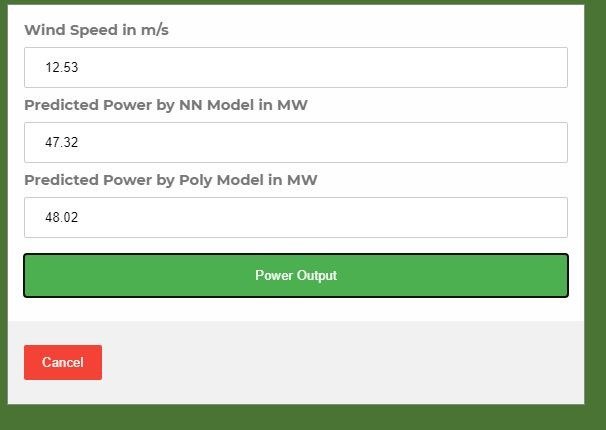

# GMIT Machine Learning and Statistic Project 2020


This repository contains a final project for Machine Learning and Statistics in the semester 2020

[See here for the instructions](https://github.com/G00376332/52954-MachineLearning/blob/master/assessment.pdf)

## The main goal of the project

* The goal of this project is to produce a model that accurately predicts wind turbine power output from wind speed values, as in the data set powerproduction.csv.
* The part of the project is to create a web service that will respond with predicted power values based on speed values sent as HTTP requests.
* Research and investigations about wind energy production
* Solution and approaching for project task
* Implementation and presentation of the project results
* Final project should contain following elements:
   * Jupyter notebook that trains a model using the data set. In the notebook, it should be explained the model and an analysis of its accuracy.
   * Python script that runs a web service based on the model, as above.
   * Dockerfile to build and run the web service in a container.


## How to run review and run project

To theoretical part of the project where basic information and the way how model was trained are included the project.ipynb.
There are couple of option to view this jupyther notebook file:

   1. The file can be downloaded locally and run on the PC with Jupyter Notebook installed
   2. It can be viewed in the web browser on the [nbviewer](https://nbviewer.jupyter.org/github/G00376332/52954-Machine_Learning_Project/blob/main/Project.ipynb)
   3. Directly on the [GitHub](https://github.com/G00376332/52954-Machine_Learning_Project/blob/main/Project.ipynb)

### How to install Jupyter Notebook

The most convenient way to quickly install Jupyter Notebook is the use of Anaconda package.  
Anaconda conveniently installs Python, the Jupyter Notebook, and other commonly used packages for scientific computing and data science.

Use the following installation steps:

Download Anaconda. Is recommend downloading Anaconda’s latest Python 3 version (currently Python 3.9).
Install the version of Anaconda which was downloaded, following the instructions on the download page.

To run the notebook type in the cmd or commander:
 **jupyter notebook**

### How to run web service

The practical part includes below files:

| **File** | **Description** |
| --- | --- |
| server.py | Flask server application in python |
| poly.sav | Polynomial regression model |
| neuron.json | Neuron network model  |
| neuron.h5 | Neuron network weights for model |
| Dockerfile | Docker image recipe file |
| requirements.txt | Required files to run this project with a Flask in the virtual environment and for Docker  |
| Folder static| The folder that contains the website for the web server |
| Folder Data| The folder with CSV file that was used to train the model in the Jupyter Notebook |


Python package has to be present on the machine where this code will be run. The python version 3.7.9 was used for this project development.

Download or clone this repository to your PC.

To run code in the virtual environment:

#### Linux
```bash
pip install -r requirements.txt
export FLASK_APP=rando.py
python3 -m flask run
```

#### Windows
```bash
pip install -r requirements.txt
set FLASK_APP=rando.py
python -m flask run
```

To build and run it as a Docker image: 

```bash
docker build . -t mlsp-server
docker run -d -p 5000:5000 mlsp-server
```
It was very difficult to get TensorFlow up and running on my machine and I had to uninstall the latest version and install alternative file from this location: [tensorflow-1.15.0-cp37-cp37m-win_amd64.whl](https://github.com/fo40225/tensorflow-windows-wheel/raw/master/1.15.0/py37/CPU%2BGPU/cuda101cudnn76sse2/tensorflow-1.15.0-cp37-cp37m-win_amd64.whl).
Download this file into this repository.
Use this file when installing requirements in case when tensorflow 1.15.0 from server doesn't work properly on your PC.

Use following command:

```bash
pip uninstall tensorflow
```

Then the alternative version 1.15.0 with modified binaries has to be installed:

```bash
pip install tensorflow tensorflow-1.15.0-cp37-cp37m-win_amd64.whl
```

The same situation is when installing requirements from the file **requirements.txt**. If you have trouble there just simply swap the below line:

tensorflow ====1.15.0

with

tensorflow @ file:///C:/**place path to your folder location**/52954-Machine_Learning_Project/tensorflow-1.15.0-cp37-cp37m-win_amd64.whl

### Web server

To access web service place address  http://127.0.0.1:5000 in the web browser.
This will redirect you to the home page of the project.
The web site contains basic information about used models for power prediction and the actual tool.
</br>

To get access to perdition tool please click on the appropriate tab in the menu.


The tool window will pop up.


Enter the wind speed in the range 1-25 and press power output button.
You will get prediction results for both models.



It is also possible to check the result from the single model directly by web API. 
From CMD or any other console, you can send the request to each model using outputpoly or outputnn accordingly.


## References

1. [Jupyter - Installing Jupyter Notebook](https://jupyter.readthedocs.io/en/latest/install.html)
1. [Jupyter - nbviewer](https://nbviewer.jupyter.org/)
1. [TensorFlow](https://www.tensorflow.org/)
1. [Docker](https://www.docker.com/?utm_source=google&utm_medium=cpc&utm_campaign=dockerhomepage&utm_content=nemea&utm_term=dockerhomepage&utm_budget=growth&gclid=CjwKCAiAouD_BRBIEiwALhJH6OrX-7RLEJItENijE7IGMqdWJoHES1R0bSXxDxfKFWA1WjADfSxUNhoCOGEQAvD_BwE)
1. [tensorflow-1.15.0-cp37-cp37m-win_amd64.whl](https://github.com/fo40225/tensorflow-windows-wheel/blob/master/1.15.0/py37/CPU%2BGPU/cuda101cudnn76sse2/tensorflow-1.15.0-cp37-cp37m-win_amd64.whl)
1. [Ianmcloughlin/random-app](https://github.com/ianmcloughlin/random-app)
